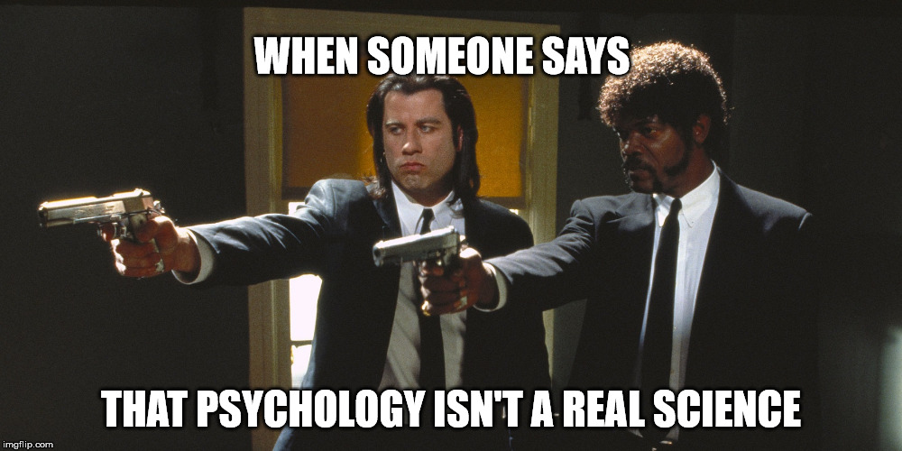

```{r setup, include=FALSE}
knitr::opts_chunk$set(echo = FALSE)
```

### Jakie s¹ psychologiczne plusy bicia ludzi?

Ogólnie mo¿e kogoœ to œmieszyæ, ale nie jest to œmieszne. Badania wskazuj¹, ¿e sztuki walki pozytywnie wp³ywaj¹ na wiele aspektów zdrowia, a co wa¿ne dla nas przysz³ych i niedosz³ych psychologów sztuki walki wp³twaj¹ pozytywnie na psychologiczny well-being a tak¿e np. zmniejszaj¹ agresjê u dzieci z ADHD [@Woodward2009] 

### Jak bicie ludzi wp³ywa na ogóln¹ agresjê?

Badania wykazuj¹, ¿e jeœli trener jest wspania³y i w ogóle, to trenowanie sztuk walki ma dzia³anie terapeutyczne, pozwala siê wyciszyæ i dziêki nauce kontrolowania agresji zmniejsza agresjê u osób doros³ych na d³ugi d³ugi czas **tak¿e u ludzi, którzy ju¿ maj¹ jakiœ problem z agresj¹** [@Twemlow1998]

### Jak bicie ludzi mo¿e pomóc dzieciom.

Badania (i to eksperymentalne!) pokaza³y, ¿e trenowanie sztuk walki pomaga w samoregulacji u dzieci `oni akurat u¿yli teakwondo, które imo jest trochê lamerskie`, no ale co poradziæ [@Lakes2004]

### Jakie pytania warto sobie zadaæ odnoœnie relacji sztuki walki/zdrowie psychiczne

1. Czy sztuki walki mog¹ pomóc osobom o za niskiej samoocenie?
2. Czy osoby o lepszej samoocenie maj¹ lepsze wyniki sportowe?
4. Czy ryzyko urazu i mo¿liwoœæ za³amki po przegranych zawodach jest na tyle du¿y ryzykiem, ¿e zwa¿aj¹c na wszystkie plusy tej dziedziny warto siê ich obawiaæ?
5. Czy sztuki walki mog¹ terapeutycznie pomóc np. ofiarom napadów lub gwa³tów?

### Czemu to jest ciekawe?

* Nie wiem
* Ale bardzo mocno chia³abym zaj¹æ siê tym w przysz³oœci
* Chcia³abym te¿ wiedzieæ, czemu ludzie przerywaj¹ trening
* I czemu nie mo¿na kupiæ tytanowych wiêzade³


### Cieszê siê, ¿e przysz³am na tipny

Od kiedy okaza³o siê, ¿e mo¿na robiæ takie ³adne spisy treœci to moje ¿ycie odmieni³o siê na lepsze. Wczeœniej te¿ nie umia³am cytowañ, a teraz spokojnie mogê zostaæ naukowcem. W domu nauczy³am siê jeszcze, ¿e mo¿na dodaæ kliczek, która pozwala odbiorcy na ukrywanie i pokazywanie kodu.

### Oto s¹ takie code chunki


```{r echo = TRUE}
library(tidyverse)
diamonds %>% 
  filter (cut == "Premium") %>% 
  arrange(desc(price)) %>% 
  top_n(10)
```

### Cytowanie innego kodu ni¿ R

Fragment pierwszej giery, która napisa³am w pygame, co to za cudowne czasy by³y

```
def drawBox(self,x, y, color = 'yellow'):
            c_draw.create_rectangle([x, y, x + self.size, y + self.size], fill=color)
        def draw(self):
            c_draw.delete("all")
            if self.col:
                c_draw.create_text([self.width / 2 * self.size, self.height / 2 * self.size], text = "Przegra³eœ› s³abiaku.\nZakoncz³eœ› na wê¿u o d³ugoœci {w}.".format(w = len(self.msnake)), font=("Arial", 20), justify = tk.CENTER)

```
### Uruchamianie innego kodu ni¿ R
```{python echo=TRUE}
def grade_converter(grade):
    if grade >= 90 :
        return "A"
    elif grade >=80:
        return "B"
    elif grade >=70 :
        return "C"
    elif grade >=65:
        return "D"
    else:
        return "F"
      
print grade_converter(92)
```

### Jeszcze jakiœ ggplocik

```{r}
library(tidyverse)
ggplot(data = diamonds) +
  geom_point(mapping = aes (x=carat, y=price, color = price)) +
  labs(title = "Iloœæ karatów a cena", x = "karaty", y= "cena")
```

### Wstawiam fotkê, poniewa¿ tak



### Bibliografia