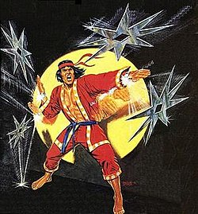
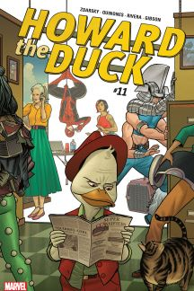

```{r setup, include=FALSE}
knitr::opts_chunk$set(echo = TRUE)
```


#### _**Nie ka¿dy superbohater w uniwersuw Marvela w³ada jakimiœ nadludzkimi zdolnoœciami czy te¿ mocami. Istniej¹ tacy, których "moc¹" jest opanowanie w kozackim stopniu jakiejœ sztuki walki (g³ównie z dalekiego wschodu). Nie sprawia to wcale, ¿e s¹ gorszymi superhero, niejednokrotnie dawali radê takim wymiataczom jak Hulk czy Captain America. Poni¿ej przedstawiê moich trzech ulubionych z tego "gatunku"**_:

* **Iron Fist**
* **Shang-Chi**
* **Howard the duck**

#### **1. Iron Fist**


_**Danny Rand**_ znany tak¿e jako Iron Fist spêdzi³ m³odoœæ trenuj¹c sztuki walki w mistycznym mieœcie _**K’un-L’un**_ i bardzo szybko sta³ siê niedoœcignionym mistrzem. Po tym jak pokona³ z³otego smoka zyska³ nadludzkie zdolnoœci koncentrowania Chi w d³oniach. Dziêki temu potrafi sprawiæ, ¿e jego piêœci staj¹ siê twarde niczym stal. Zawsze kieruje siê honorem i stawia przyjació³ na pierwszym miejscu.

**Chyba jest to najbardziej znany bohater u¿ywaj¹cy wschodnich sztuk walki. Debiutowa³ w 1974 roku, i od tego czasu goœci na ³amach komiksów jako jeden z Bohaterów do Wynajêcia czy te¿ cz³onek Defenders. Zdecydowanie polecam komiksy z jego udzia³em, a serial odradzam (Robi go netflix i jest tragiczny). Ale mo¿na [obadaæ](https://www.youtube.com/watch?v=f9OKL5no-S0). Ale nie warto :)**

<div style="width:160px; height:220px">

</div>
>


#### **2. Shang-Chi**

Ten bohater trafi³ na ³amy komiksu w 1973 roku i wywalczy³ swoj¹ popularnoœæ po dwóch miesi¹cach istnienia. Wszystko za spraw¹ pojawienia siê w kinach kultowego filmu Wejœcie Smoka. Shan-Chi by³ synem groŸnego chiñskiego wojownika **Fu Manchu**. Komiksy z jego przygodami obfitowa³y w dramatyczne zwroty akcji, bo opisywa³y zmagania m³odego mistrz Kung Fu z rodzicami, którzy pragnêli przej¹æ w³adzê nad œwiatem. `to s¹ dopiero problemy, a nie, ¿e czyjœ tata nie p³aci alimentów`

Od m³odego szkolony na p³atnego zabójce Shan-Chi to œwietny przyk³ad bohatera, który nie ma ¿adnych nadludzkich zdolnoœci a mimo to jest zajebisty i to wszystko dziêki ciê¿kiej pracy i treningom. Ponadto dorasta³ w trudnej rodzinie, wiêc wiele ludzi mo¿e siê z nim uto¿samiæ i ma to sens dydaktyczny, bo pokazuje dzieciakom, ¿e ciê¿ka praca pop³aca, nawet jak Twoi rodzice to z³odupcy.

<div style="width:160px; height:160px">

</div>
>

#### 3. **Howard the Duck**

Howard jako jedyny opanowa³ do perfekcji wodny styl walki znany jako **Quack Fu.** Zosta³ stworzony tak naprawdê jako ¿art w komiksie i tak te¿ z pocz¹tku by³ traktowany. Jednak zdoby³ tak du¿¹ popularnoœæ, ¿e po dwóch latach dosta³ nawet w³asn¹ seriê komiksow¹. Jest uto¿samiany z pora¿k¹, jednak to naprawdê interesuj¹ca postaæ. Buntownik, który stara odnaleŸæ siê w spo³eczeñstwie. Co za cudowna sprawa, co nie? Ka¿dy mo¿e siê poczuæ takim Howardem i to fajursko pokazuje, ¿e pora¿ka to nie jest przypa³ stulecia.

<div style="width:160px; height:220px">

</div>
>

#### **Dobra to teraz rozkmina - powy¿si superheoroes vs. moi ulubieni superheroes, czy wygranko czy przegranko?** `moim zdaniem ofc`

| Superbohater bez mocy | Superbohater z moc¹/metaludzie/ludziokosmici | Wygranko w walce | Rozrywkowoœc walki w skali 0-9 |
|-----------------------|---------------------|-------------|--------------------------------|
| Iron Fist | Daredevil | Daredevil | 5 |
| Shang - Chi | Star-Lord [Peter Quill] | Shang - Chi | 6 |
| Howard the Duck | Wolverine | Wolverine | 9 |


Chwilowo pojawi³ siê wczeœniej temat o tym, ¿e netflix zrobi³o ciulowego Iron Fista. I niestety trochê tak jest, ¿e netflix zabiera siê za fajnych superbohaterów (Iron Fist, Black Lighting), ale robi s³abe seriale np. _The Defenders_ to jest jakiœ ¿art. ALE! Daredevil i Punisher wyszli cudowni wiêc wydajê mi siê, ¿e trochê tak jest, ¿e ci mniej znani maj¹ lipne seriale.

Trochê jestem jednak ma³o kreatywna i nie wiem jak do tematu dopasowaæ code chunki, wiêc wrzucam randomowe.

```{r echo = FALSE} 
library(tidyverse)
ggplot(data = mpg) +
  geom_point(mapping = aes (x=displ, y=cty)) +
  labs(title = "Pojemnoœæ silnika a spalania w mieœcie", x = "pojemnoœæ", y= "spalanie w mieœcie") +
  theme_light()
```


```{r}
paste ("Za ile godzin wreszcie skoncza sie te studia?")
today <- Sys.Date()
koniec_tego_koszmaru <- as.Date("2021-06-30")

hours <- as.numeric(difftime(koniec_tego_koszmaru, today), units="hours")
dodac <- as.numeric(difftime(strptime("23:59", format = "%H:%M"), 
                             strptime("23:59", format = "%H:%M")), units="hours")
print ("Czy kiblowa³eœ, jeœli tak to podaj ile to bylo, w latach?")

lata_kiblowania <- c(0) #w miejsce 0 mozna wpisac lata jakie sie kiblowa³o czy coœ tam !!PYTANKO!! Jak zrobic, zeby to uzytkownik mogl to wpisac, nie muszac wchodzic w kod zrodlowy?

hours <- hours + dodac + (lata_kiblowania * 8760)

paste("Ten koszmar skonczy sie za...", hours, "godzin")
```

```{r}
library(tidyverse)
data(diamonds)
select(diamonds, color)
```

##### **To by by³o chyba na tyle, mam nadziejê ogromn¹, ¿e o to chodzi³o.**

